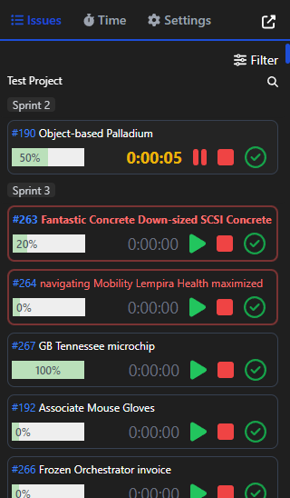
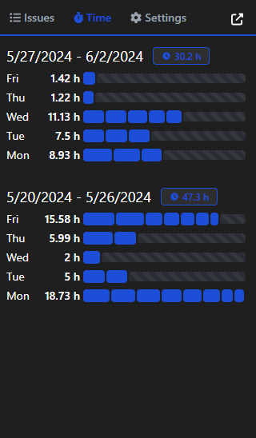
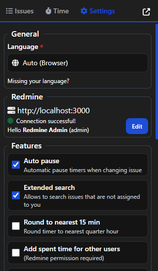
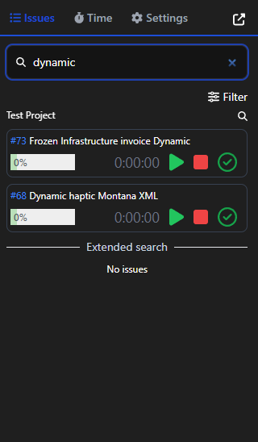
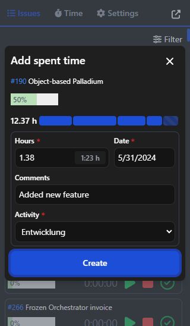
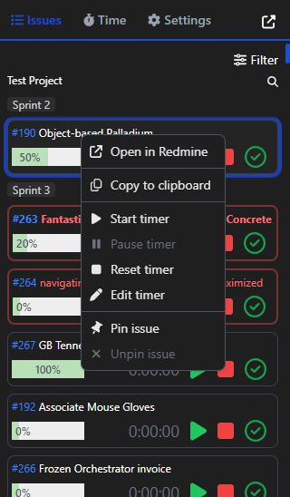

# Redmine Time Tracking (Chrome Extension / Firefox Extension)

> Start-stop timer for [Redmine](https://www.redmine.org/).

[![Install-Button-Chrome]][Install-Link-Chrome]
[![Install-Button-Firefox]][Install-Link-Firefox]

[Install-Button-Chrome]: https://img.shields.io/badge/Install-71b500?style=for-the-badge&logoColor=white&logo=google-chrome
[Install-Link-Chrome]: https://chrome.google.com/webstore/detail/redmine-time-tracking/ldcanhhkffokndenejhafhlkapflgcjg "Open in chrome web store"
[Install-Button-Firefox]: https://img.shields.io/badge/Install-71b500?style=for-the-badge&logoColor=white&logo=firefox-browser
[Install-Link-Firefox]: https://addons.mozilla.org/de/firefox/addon/redmine-time-tracking "Open in firefox add-on store"

# Features

- View all your assigned Redmine issues grouped by projects
- Filter issues by projects
- Group issues by target version
- Search for issues (press `CTRL` + `K` or `CTRL` + `F`)
- Start, stop and edit the timer for your current tasks
- Create entry for time spent (and for multiple users at once)
- Update done ratio for issues
- Pin and unpin issues (display at the top of the project)
- Remember and forget issue (not assigned to you)
- View time entries for current and last week
- Multiple languages
- Dark & light mode (system default)

# Requirements

At least Redmine version `3.0` or higher required. Recommended version `5.0` or higher.

### Unsupported features by Redmine versions

| Feature                                                                           | Unsupported Redmine version |
| --------------------------------------------------------------------------------- | --------------------------- |
| Show only **enabled** issue field for selected tracker when _creating new issues_ | `< 5.0.0`                   |
| Show only **allowed statuses** when _updating issue_                              | `< 5.0.0`                   |
| Show spent vs estimated hours                                                     | `< 5.0.0`                   |
| Select the **default fixed version** when _creating new issues_                   | `< 4.1.1`                   |
| Check permissions for admin users who are not members of a project                | `< 4.0.0`                   |
| Display project-available time entry activities when _adding spent time entries_  | `< 3.4.0`                   |
| Extended search                                                                   | `< 3.3.0`                   |

_Tested with Google Chrome Version 130 and Firefox 132_

# Supported languages

- English
- German
- Russian (thanks [@ASM-Development](https://github.com/ASM-Development))
- French (thanks [@S8N02000](https://github.com/S8N02000))

> If you want to add more languages or extend existing ones, feel free to contribute. Just create a pull request with the desired changes. The language files are located under [src/lang](src/lang) and [public/\_locales](public/_locales).

# Screenshots

# Credits

Logo is Copyright (C) 2009 Martin Herr and is licensed under Creative Commons (https://www.redmine.org/projects/redmine/wiki/logo)
