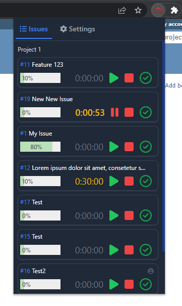
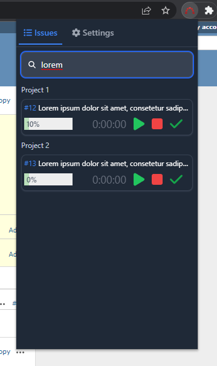
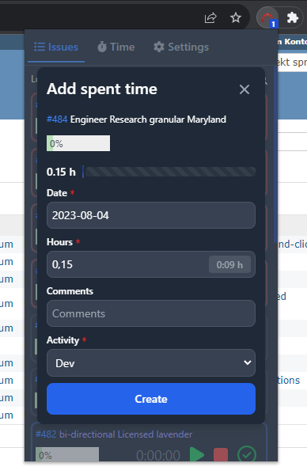
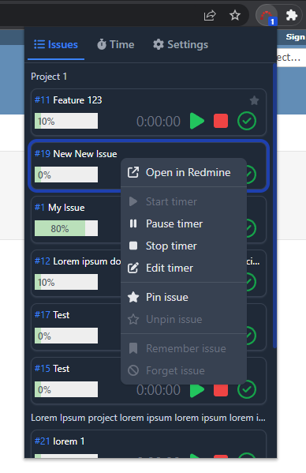
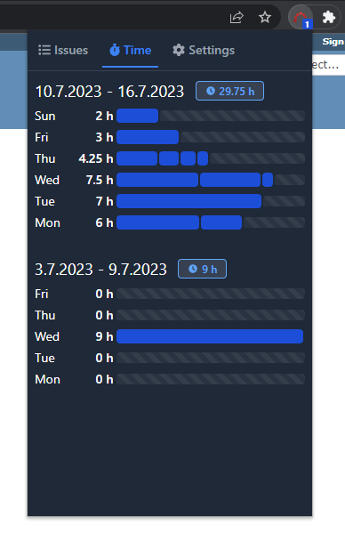

# Redmine Time Tracking (Chrome Extensions)

> Start-stop timer for [Redmine](https://www.redmine.org/).

[![Install Button]][Install Link]

[Install Button]: https://img.shields.io/badge/Install-71b500?style=for-the-badge&logoColor=white&logo=DocuSign
[Install Link]: https://chrome.google.com/webstore/detail/redmine-time-tracking/ldcanhhkffokndenejhafhlkapflgcjg "Open in chrome web store"

# Features

- View all your assigned Redmine issues
- Filter issues by projects
- Group issues by target version
- Search for issues (press `CTRL` + `K` or `CTRL` + `F`)
- Start and stop the timer for your current tasks
- Create entry for time spent in Redmine issue
- Create time spent entries for other users
- Update done ratio
- Round timer to nearest 15 min
- Edit timer (double-click)
- Pin and unpin issue
- Remember and forget issue (not assigned to you)
- View time entries overview
- Multiple languages
- Dark & light mode (system default)

# Requirements

At least Redmine version `4.1.0` or higher required. Recommended version `5.0` or higher. Some features may not work in old Redmine versions.

Tested with Google Chrome Version 121

# Supported languages

- English
- German
- Russian (thanks [@Develop-FM](https://github.com/Develop-FM))

> If you want to add more languages or extend existing ones, feel free to contribute. Just create a pull request with the desired changes. The language files are located under [src/lang](src/lang) and [public/\_locales](public/_locales).

# Screenshots

# Credits

Logo is Copyright (C) 2009 Martin Herr and is licensed under Creative Commons (https://www.redmine.org/projects/redmine/wiki/logo)
