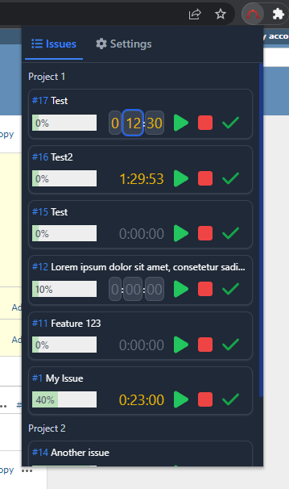

# Redmine Time Tracking (Chrome Extensions)

> Start-stop timer for [Redmine](https://www.redmine.org/).

[![Install Button]][Install Link]

[Install Button]: https://img.shields.io/badge/Install-71b500?style=for-the-badge&logoColor=white&logo=DocuSign
[Install Link]: https://chrome.google.com/webstore/detail/redmine-time-tracking/ldcanhhkffokndenejhafhlkapflgcjg "Open in chrome web store"

# Features

- View all your assigned Redmine issues
- Start and stop the timer for your current tasks
- Edit timer by double-click on timer
- Transfer the timer to the Redmine issue
- Round timer to nearest 15 min
- Search for issue (press `CTRL` + `K` or `CTRL` + `F`)
- Dark & light mode (system default)

# Screenshots

# Credits

Logo is Copyright (C) 2009 Martin Herr and is licensed under Creative Commons (https://www.redmine.org/projects/redmine/wiki/logo)
